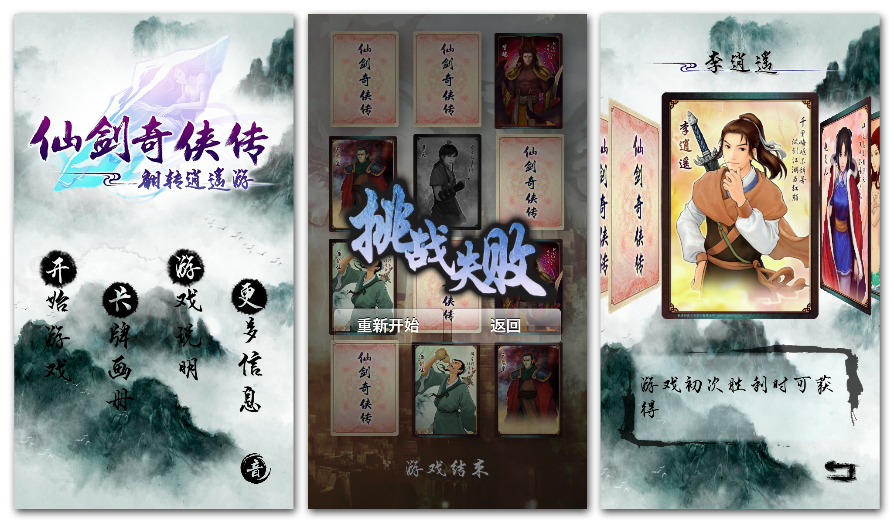

  

<h1 align="center">
  PalCard
</h1>

  仙剑奇侠传五前传卡牌小游戏iPhone版

  

## Demo 演示视频

## Platform

* Xcode 4.6
* Target: iOS 5.0
* iPhone 3GS/4/4S/5 supported

## V 1.0 -> V 1.1 更新说明

1.修复bug，卡牌解锁条件轻微调整

2.游戏难度调整，增加新模式"自由"

3.优化游戏性能，UI轻微调整

4.卡牌点击即可放大看高清原图

5.增加数据中心，显示游戏数据

6.增加准备和开始提示以及时间进度条

## Dependencies and References

* iCarousel : https://github.com/nicklockwood/iCarousel
* MCSoundBoard : https://github.com/Baglan/MCSoundBoard
* FXImageView : https://github.com/nicklockwood/FXImageView
* ASMediaFocusManager : https://github.com/autresphere/ASMediaFocusManager

## 版权信息

本游戏使用的大部分图片素材以及音频资料来源于仙剑奇侠传五前传，仙剑奇侠传五前传为软星科技（北京）有限公司作品，所有涉及图片以及音频资料版权均归软星科技（北京）有限公司所有，本游戏为免费游戏，无广告，无应用内支付，不带任何盈利目的，请不要二次使用本游戏所持内容。

